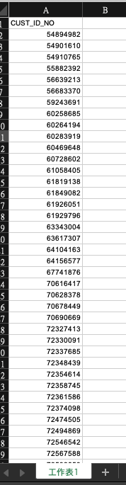

# Coding起來 - Python小工具 - 快速查詢商工登記資料

YoYo 今天想來分享一個我最近為了方便快速查詢公司營業狀態所開發的小工具，如果大家有跟查詢手邊公司營業狀態的需求，這個小工具能夠幫助大家省下大量的時間喔


## ㄧ. 商工登記資料查詢
當我們要查詢一間公司的資訊時，大家可能直接就會想到商工登記公示資料查詢服務(https://findbiz.nat.gov.tw/fts/query/QueryBar/queryInit.do)，網頁中我們可以輕鬆透過文字搜尋我們想要瞭解的公司


問題: 如果我們手上有上萬筆的公司需要查詢，我們總不能每次都一個一個查詢吧，要查到天荒地老


## 二. 自動化查詢商工登記資料工具介紹

### STEP 1: 這邊我寫了一個Python小工具來幫助大家快速查詢，首先我們先把要查詢的公司統編像圖片一樣放入Excel中，並把列名取名為“CUST_ID_NO”




### STEP 2: 執行Python工具

作法: 由於公司有可能會是商業登記或是公司登記，所以我們需要都檢查

**提醒：由於公司統編為八碼，所以我們程式會檢查是否為八碼，沒有的話會補0**

```Python
import pandas as pd
import requests
import xml.etree.ElementTree as ET
import time

def load_data():
    dataset = pd.read_csv('company_id.csv')
    ## test 1000 data
    ## dataset = dataset[:10]
    data = list(dataset['CUST_ID_NO'])
    
    ## 檢查是否有八位數，沒有就前面補0
    for i in range(len(data)):
        data[i] = data[i].zfill(8)
    
    return dataset, data

def exc(data):
    ## load
    status = []
    c_name = []

    ## 檢查營業狀態: 公司登記
    progress = 1
    for i in data:
        print('進度: ' + str(progress) + ' / '+ str(len(data)))
        print('查詢公司: ', i)
        progress += 1
        html = requests.get('https://data.gcis.nat.gov.tw/od/data/api/F05D1060-7D57-4763-BDCE-0DAF5975AFE0?$format=xml&$filter=Business_Accounting_NO%20eq '+ i +'&$skip=0&$top=1')
        root = ET.fromstring(html.text)
    #     print(html.text)
    #     print(root[0][3].text)
        if len(root) == 1:
            status.append(root[0][3].text)
            c_name.append(root[0][1].text)
            print(root[0][3].text)
        elif len(root) == 0:
            print('公司登記查不到...')
            print('開始查詢商業登記狀態...')
            ## 檢查營業狀態: 商業登記(經公司登記篩選為查無此資料的公司，再透過商業登記篩選)
            html = requests.get('https://data.gcis.nat.gov.tw/od/data/api/426D5542-5F05-43EB-83F9-F1300F14E1F1?$format=xml&$filter=President_No eq '+i+'&$skip=0&$top=1')
            root = ET.fromstring(html.text)
            if len(root) == 1:
                status.append(root[0][3].text)
                c_name.append(root[0][1].text)
                print(root[0][3].text)
            elif len(root) == 0:
                status.append('查無資料')
                c_name.append('查無資料')
                print('公司登記與商業登記都查無資料')
        time.sleep(3)
        
    return status, c_name


def save(dataset, status, c_name):
    dataset['status'] = status
    dataset['company'] = c_name
    dataset.to_csv('company_status.csv', encoding = 'utf-8-sig')


if __name__ == '__main__':
    dataset, data = load_data()
    status, c_name = exc(data)
    save(dataset, status, c_name) 
```
執行過程




Note: 大家可以把它放到Kaggle或Colab上執行，速度會快很多XD

### STEP 3: 打開產出的Excel - company_status.csv
這樣我們就擁有營業狀態跟公司名稱了！！


### 補充: 如何取得更多開放資料
這個平台有開放資料的API讓大家可以輕鬆選擇自己想要抓去的資料喔
https://data.gcis.nat.gov.tw/main/index#


這篇簡單地製作了一個簡易的自動化查詢工具，但大大的幫助我在工作上減少非常多的時間，感謝大家的閱讀


